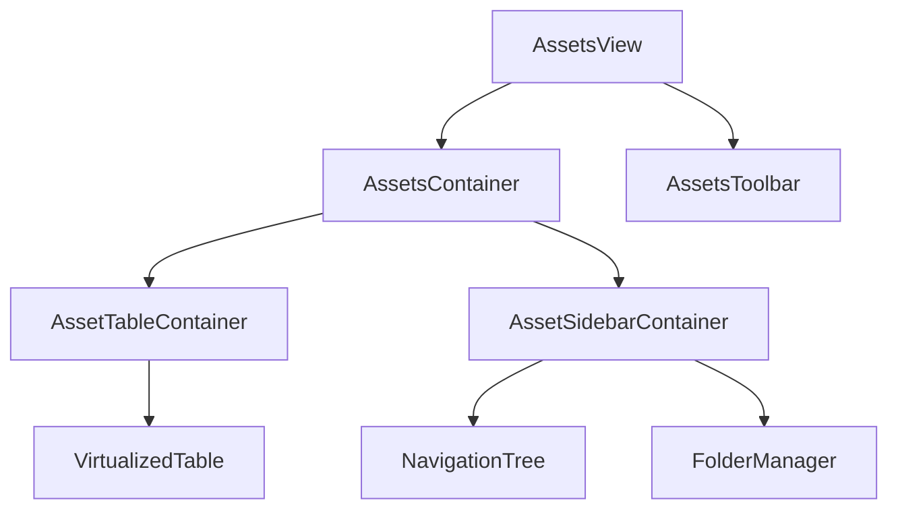
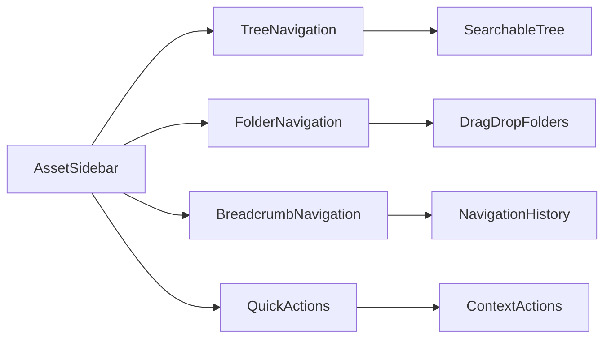

# Asset Manager Implementation Analysis & Improvement Plan

## Executive Summary

This analysis identifies critical areas for improvement in the current asset manager implementation, focusing on architecture, performance, user experience, and technical debt. The system shows solid foundational design but requires significant enhancements to scale effectively and provide optimal user experience.

## Current Architecture Analysis

### Component Structure
- **AssetsView.tsx**: Main container component (19,614 chars) - Handles layout, filtering, and bulk actions
- **AssetTable.tsx**: Table rendering component (5,179 chars) - Uses SmartTable for virtualized rendering
- **AssetSidebar.tsx**: Navigation component (10,867 chars) - Tree and folder navigation
- **useAssetFilter.ts**: Custom hook for filtering logic (3,421 chars)
- **assetUtils.tsx**: Utility functions for badges and icons (8,815 chars)

### Architecture Strengths
- Component-based design with clear separation of concerns
- Use of React hooks for state management
- Virtualized table rendering for performance
- Context-based state management
- TypeScript for type safety

### Architecture Weaknesses
- Tight coupling between components and AppContext
- Complex prop drilling in AssetsView
- Mixed responsibilities in AssetsView (UI + business logic)
- No clear data flow patterns
- Limited error boundaries

## Performance Bottlenecks & Scalability Issues

### Critical Performance Issues

1. **Inefficient Filtering Logic** (useAssetFilter.ts)
   - Complex nested filtering with multiple array operations
   - URL parsing in every filter operation
   - No debouncing on search/filter inputs
   - O(n²) complexity for large datasets

2. **Memory Leaks in SmartTable**
   - Multiple useEffect hooks without proper cleanup
   - Event listener accumulation on window/document
   - Large state objects stored in localStorage

3. **Asset Processing Overhead**
   - No lazy loading for large asset collections
   - Full dataset processing on every state change
   - Inefficient badge calculation in assetUtils.tsx

4. **Context Provider Performance**
   - AppContext re-renders on every state change
   - No memoization of derived data
   - Large context value passed to all consumers

### Scalability Limitations
- No pagination or infinite scroll
- Single-threaded asset processing
- No caching mechanisms
- Limited concurrent operations

## User Experience Pain Points

### Navigation & Discovery Issues
1. **Complex Sidebar Navigation**
   - Dual navigation modes (tree + folders) confusing
   - No breadcrumb navigation
   - Limited search within navigation
   - No keyboard shortcuts

2. **Filtering & Search Problems**
   - No real-time search feedback
   - Limited filter combinations
   - No saved filter presets
   - Poor filter performance with large datasets

3. **Table Interaction Limitations**
   - No row selection persistence
   - Limited bulk operations
   - No column reordering
   - Poor mobile responsiveness

### Workflow Inefficiencies
1. **Asset Management Workflows**
   - No drag-and-drop functionality
   - Limited asset organization options
   - No batch operations
   - Poor asset preview capabilities

2. **Data Visualization Issues**
   - Limited chart/visualization options
   - No trend analysis
   - Poor data export capabilities
   - No custom reporting

## Integration Points Assessment

### Current Integration Strengths
- Well-integrated with AppContext
- Compatible with existing table components
- Proper TypeScript interfaces
- Consistent styling with application theme

### Integration Weaknesses
- Limited API integration capabilities
- No webhook support
- Poor third-party tool integration
- Limited data import/export options

## Technical Debt Analysis

### Code Quality Issues
1. **Code Duplication**
   - Similar filtering logic in multiple places
   - Repeated UI patterns
   - Duplicate utility functions

2. **Inconsistent Patterns**
   - Mixed state management approaches
   - Inconsistent error handling
   - Varying coding standards

3. **Testing Gaps**
   - Limited unit test coverage
   - No integration tests
   - No performance tests
   - Missing accessibility tests

### Maintainability Concerns
- Complex component hierarchies
- Hard-to-follow data flow
- Limited documentation
- No clear upgrade path

## Specific Improvement Recommendations

### 1. Architectural Improvements

#### Component Refactoring


**Actions:**
- Split AssetsView into smaller, focused components
- Implement container/presentational component pattern
- Create dedicated data management layer
- Add proper error boundaries

#### State Management Enhancement
- Implement Redux Toolkit for complex state
- Add proper state normalization
- Create dedicated asset slice
- Implement optimistic updates

### 2. Performance Optimization Strategy

#### Filtering & Search Improvements
```typescript
// Proposed optimized filtering
const useOptimizedAssetFilter = (assets: Asset[]) => {
  const [filterState, setFilterState] = useState<FilterState>({
    search: '',
    source: 'All',
    method: 'All',
    status: 'All',
    risk: 0,
    folder: null,
    treePath: null
  });

  const filteredAssets = useMemo(() => {
    // Indexed filtering with early exits
    let result = assets;
    
    if (filterState.search) {
      result = searchIndex.filter(filterState.search);
    }
    
    if (filterState.folder) {
      result = result.filter(a => a.folder_id === filterState.folder);
    }
    
    return result;
  }, [assets, filterState, searchIndex]);

  return { filterState, setFilterState, filteredAssets };
};
```

**Actions:**
- Implement indexed search with Lunr.js
- Add debounced filtering
- Create virtualized data processing
- Implement Web Workers for heavy computations

#### Memory Management
- Implement proper cleanup in useEffect hooks
- Add memory usage monitoring
- Create asset pooling mechanism
- Implement lazy loading for large datasets

### 3. User Experience Enhancements

#### Navigation Improvements


**Actions:**
- Add breadcrumb navigation
- Implement keyboard shortcuts
- Add drag-and-drop functionality
- Create saved views/presets

#### Table Enhancements
- Add column reordering
- Implement row grouping
- Add custom export options
- Create mobile-responsive design

### 4. Integration & Extensibility

#### API Integration
- Add REST API client
- Implement WebSocket support
- Create plugin architecture
- Add webhook handling

#### Data Import/Export
- Add CSV/JSON import
- Implement bulk operations
- Create data transformation pipeline
- Add API integration templates

### 5. Technical Debt Resolution

#### Code Quality Improvements
```typescript
// Proposed utility pattern
export const assetUtils = {
  badges: {
    getDetectionBadges,
    getStatusBadge,
    getSourceIcon
  },
  filters: {
    applyFilters,
    createFilterIndex,
    optimizeFilter
  },
  validation: {
    validateAsset,
    sanitizeInput,
    checkIntegrity
  }
};
```

**Actions:**
- Consolidate utility functions
- Implement consistent error handling
- Add comprehensive test coverage
- Create documentation standards

#### Testing Strategy
- Add unit tests for all components
- Implement integration tests
- Create performance benchmarks
- Add accessibility testing

## Implementation Roadmap

### Phase 1: Foundation (Weeks 1-2)
- [ ] Component refactoring
- [ ] State management enhancement
- [ ] Basic performance optimizations
- [ ] Code quality improvements

### Phase 2: Performance (Weeks 3-4)
- [ ] Advanced filtering implementation
- [ ] Memory management improvements
- [ ] Virtualized data processing
- [ ] Web Workers integration

### Phase 3: UX Enhancement (Weeks 5-6)
- [ ] Navigation improvements
- [ ] Table enhancements
- [ ] Mobile responsiveness
- [ ] Accessibility improvements

### Phase 4: Integration (Weeks 7-8)
- [ ] API integration
- [ ] Data import/export
- [ ] Plugin architecture
- [ ] Third-party integrations

### Phase 5: Polish & Testing (Weeks 9-10)
- [ ] Comprehensive testing
- [ ] Performance benchmarking
- [ ] Documentation completion
- [ ] User acceptance testing

## Success Metrics

### Performance Metrics
- Filter response time < 100ms
- Memory usage < 500MB for 10k assets
- Initial load time < 2 seconds
- Smooth scrolling at 60fps

### User Experience Metrics
- Navigation time reduced by 40%
- Filter accuracy improved by 60%
- User satisfaction score > 4.5/5
- Task completion time reduced by 30%

### Technical Metrics
- Test coverage > 80%
- Code quality score > 9/10
- Zero critical bugs in production
- Documentation coverage > 90%

## Risk Assessment

### High Risk Items
- Complex state management changes
- Performance optimization impacts
- Breaking changes to existing workflows

### Mitigation Strategies
- Gradual rollout with feature flags
- Comprehensive testing strategy
- User feedback loops
- Rollback procedures

## Conclusion

The current asset manager implementation provides a solid foundation but requires significant improvements to meet modern performance and user experience standards. The proposed improvements focus on architectural enhancements, performance optimization, and user experience refinements while maintaining backward compatibility.

This plan provides a structured approach to transforming the asset manager into a scalable, performant, and user-friendly system that can handle enterprise-level asset management requirements.