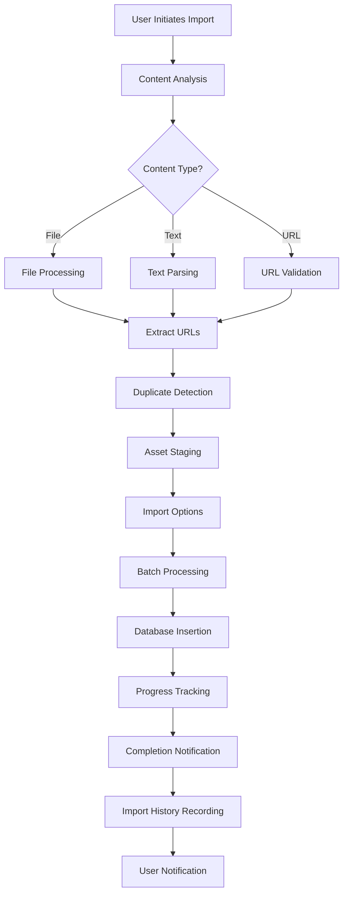
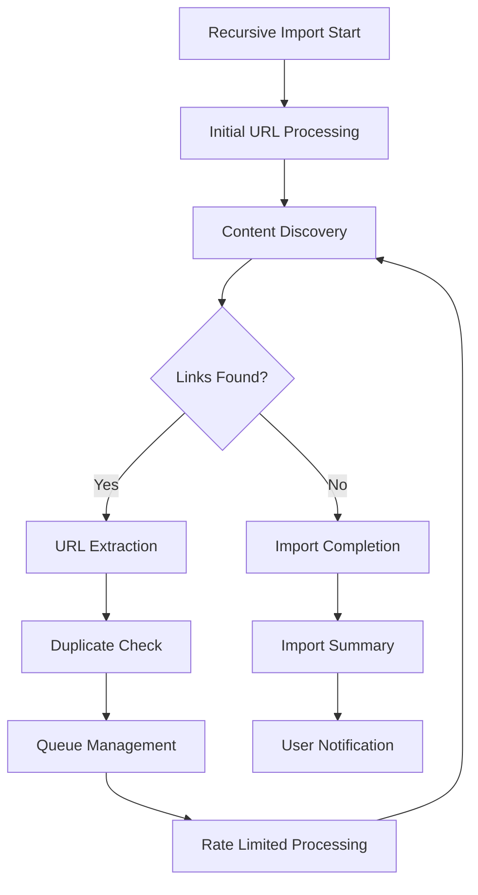

# Improved Asset Import System - Technical Specification

## Executive Summary

This document outlines a comprehensive redesign of the asset import system to address current limitations and implement advanced features for improved user experience, reliability, and performance.

## 1. Component Architecture

### 1.1 Frontend Components

#### ImportManager (Enhanced)
```typescript
interface EnhancedImportManagerProps {
  isOpen: boolean;
  onClose: () => void;
  onImport: (assets: ImportAsset[], options: ImportOptions) => Promise<void>;
  onAnalyze?: (report: any, content: string) => void;
  existingUrls: Set<string>;
  importHistory: ImportOperation[];
}

interface ImportOptions {
  destination: 'asset_manager' | 'workbench';
  recursive: boolean;
  batchMode: boolean;
  rateLimit: number;
  autoTriage: boolean;
}

interface ImportAsset {
  id: string;
  url: string;
  method: string;
  source: string;
  selected: boolean;
  status: 'valid' | 'invalid' | 'duplicate' | 'processing' | 'completed' | 'failed';
  error?: string;
  metadata?: {
    contentType: string;
    contentLength: number;
    responseTime: number;
  };
  importId?: string;
}
```

#### New Components

**ImportPreviewPanel**
- Shows clean, stripped view of assets being imported
- Provides URL validation and method detection
- Displays content type and size estimates
- Shows duplicate detection results

**ImportProgressPanel**
- Real-time progress tracking
- Batch processing status
- Rate limiting indicators
- Error reporting with suggestions

**ImportHistoryPanel**
- Chronological view of import operations
- Metadata tracking (timestamp, source, count, status)
- Quick re-import functionality
- Performance analytics

### 1.2 Backend Services

#### ImportService
```rust
pub struct ImportService {
    db: Arc<Mutex<Database>>,
    client: reqwest::Client,
    rate_limiter: Arc<RateLimiter>,
}

impl ImportService {
    pub async fn process_import(
        &self,
        assets: Vec<ImportAsset>,
        options: ImportOptions,
    ) -> Result<ImportResult, ImportError> {
        // Batch processing with rate limiting
        // Duplicate detection and handling
        // Progress tracking and reporting
    }

    pub async fn analyze_content(
        &self,
        content: String,
        content_type: ContentType,
    ) -> Result<ContentAnalysis, AnalysisError> {
        // Robust URL detection
        // Method extraction
        // Content validation
    }
}
```

#### ImportHistoryService
```rust
pub struct ImportHistoryService {
    db: Arc<Mutex<Database>>,
}

impl ImportHistoryService {
    pub async fn record_operation(
        &self,
        operation: ImportOperation,
    ) -> Result<i64, DatabaseError> {
        // Store import metadata
        // Track performance metrics
        // Enable analytics
    }

    pub async fn get_history(
        &self,
        limit: usize,
        offset: usize,
    ) -> Result<Vec<ImportOperation>, DatabaseError> {
        // Retrieve import history
        // Support filtering and sorting
    }
}
```

## 2. Data Flow Diagrams

### 2.1 Import Operation Flow


### 2.2 Recursive Import Flow


## 3. UI Mockups

### 3.1 Enhanced Import Interface
```
+-----------------------------------------------------------------------------------+
| Import Manager [x]                                                                |
+-----------------------------------------------------------------------------------+
| File Upload | Paste Text | Import History | Settings | Progress | Help           |
+-----------------------------------------------------------------------------------+
|                                                                                   |
|  Drag & Drop Files Here                                                          |
|  CSV, JSON, XLSX, TXT, or URLs                                                   |
|                                                                                   |
|  [Select Files] [Paste Content] [Import History] [Settings]                      |
|                                                                                   |
+-----------------------------------------------------------------------------------+
| Destination: [Asset Manager] [Workbench] | Discovery: [Recursive] [Batch Mode] |
+-----------------------------------------------------------------------------------+
|                                                                                   |
|  Import Preview                                                                  |
|  ┌─────────────────────────────────────────────────────────────┐                 |
|  │ URL │ Method │ Status │ Source │ Actions │                     |
|  ├─────────────────────────────────────────────────────────────┤                 |
|  │ GET /api/users │ GET │ Valid │ File.csv │ [x] Remove │         |
|  │ POST /api/login │ POST │ Duplicate │ Paste │ [-] Skip │         |
|  │ https://example.com │ GET │ Invalid │ URL │ [?] Details │      |
|  └─────────────────────────────────────────────────────────────┘                 |
|                                                                                   |
|  [Select All] [Select None] [Remove Selected] [Import Selected]                 |
|                                                                                   |
+-----------------------------------------------------------------------------------+
| Progress: [=================     ] 75% (45/60) | Speed: 12 assets/sec | ETA: 5s |
+-----------------------------------------------------------------------------------+
```

### 3.2 Import History Interface
```
+-----------------------------------------------------------------------------------+
| Import History [x] | [Clear All] | [Settings] | [Help]                           |
+-----------------------------------------------------------------------------------+
|                                                                                   |
|  Filter: [All] [Successful] [Failed] [Duplicates] | Sort: [Date] [Count] [Duration] |
|                                                                                   |
|  ┌─────────────────────────────────────────────────────────────────────────────┐ |
|  │ Date │ Source │ Count │ Status │ Duration │ Actions │                         |
|  ├─────────────────────────────────────────────────────────────────────────────┤ |
|  │ 2024-01-15 14:32 │ File Upload │ 45 │ Success │ 12s │ [View] [Reimport] │   |
|  │ 2024-01-14 09:15 │ Paste │ 12 │ Partial │ 8s │ [View] [Reimport] │    |
|  │ 2024-01-13 16:45 │ URL │ 3 │ Failed │ 5s │ [View] [Reimport] │     |
|  └─────────────────────────────────────────────────────────────────────────────┘ |
|                                                                                   |
|  Import Analytics:                                                               |
|  - Total Imports: 120                                                            |
|  - Success Rate: 94.2%                                                           |
|  - Average Duration: 9.3s                                                       |
|  - Most Common Source: File Upload (65%)                                        |
|                                                                                   |
+-----------------------------------------------------------------------------------+
```

## 4. Backend API Design

### 4.1 Import Management API

#### POST /api/import/analyze
```typescript
interface AnalyzeRequest {
  content: string;
  contentType: 'file' | 'text' | 'url';
  fileName?: string;
}

interface AnalyzeResponse {
  assets: ImportAsset[];
  analysis: {
    urlCount: number;
    validUrls: number;
    duplicates: number;
    invalidUrls: number;
    contentType: string;
    estimatedSize: number;
  };
  warnings: string[];
  suggestions: string[];
}
```

#### POST /api/import/process
```typescript
interface ProcessRequest {
  assets: ImportAsset[];
  options: ImportOptions;
}

interface ProcessResponse {
  importId: string;
  totalAssets: number;
  validAssets: number;
  duplicates: number;
  status: 'queued' | 'processing' | 'completed' | 'failed';
  progressUrl: string;
  estimatedTime: number;
}
```

#### GET /api/import/status/{importId}
```typescript
interface StatusResponse {
  importId: string;
  status: 'queued' | 'processing' | 'completed' | 'failed';
  progress: {
    completed: number;
    total: number;
    percentage: number;
    currentSpeed: number;
    estimatedTimeRemaining: number;
  };
  results: {
    successful: number;
    failed: number;
    duplicates: number;
    errors: ImportError[];
  };
  timestamp: string;
}
```

#### GET /api/import/history
```typescript
interface HistoryRequest {
  limit?: number;
  offset?: number;
  status?: 'all' | 'success' | 'failed' | 'partial';
  sortBy?: 'date' | 'count' | 'duration';
  sortOrder?: 'asc' | 'desc';
}

interface HistoryResponse {
  operations: ImportOperation[];
  totalCount: number;
  pageInfo: {
    limit: number;
    offset: number;
    hasNext: boolean;
    hasPrev: boolean;
  };
}
```

### 4.2 URL Processing API

#### POST /api/import/urls/validate
```typescript
interface ValidateRequest {
  urls: string[];
  methods?: string[];
}

interface ValidateResponse {
  results: Array<{
    url: string;
    method: string;
    isValid: boolean;
    isDuplicate: boolean;
    suggestions?: string[];
  }>;
  statistics: {
    total: number;
    valid: number;
    invalid: number;
    duplicates: number;
  };
}
```

## 5. Database Schema Changes

### 5.1 New Tables

#### import_operations
```sql
CREATE TABLE import_operations (
    id INTEGER PRIMARY KEY AUTOINCREMENT,
    import_id TEXT NOT NULL UNIQUE,
    source TEXT NOT NULL,
    total_assets INTEGER NOT NULL,
    successful_assets INTEGER NOT NULL DEFAULT 0,
    failed_assets INTEGER NOT NULL DEFAULT 0,
    duplicate_assets INTEGER NOT NULL DEFAULT 0,
    status TEXT NOT NULL DEFAULT 'queued',
    options TEXT NOT NULL, -- JSON: destination, recursive, batch_mode, etc.
    duration_ms INTEGER,
    error_message TEXT,
    created_at DATETIME DEFAULT CURRENT_TIMESTAMP,
    updated_at DATETIME DEFAULT CURRENT_TIMESTAMP
);

CREATE INDEX idx_import_operations_status ON import_operations(status);
CREATE INDEX idx_import_operations_created_at ON import_operations(created_at);
```

#### import_assets
```sql
CREATE TABLE import_assets (
    id INTEGER PRIMARY KEY AUTOINCREMENT,
    import_id TEXT NOT NULL,
    asset_id INTEGER NOT NULL,
    url TEXT NOT NULL,
    method TEXT NOT NULL,
    status TEXT NOT NULL DEFAULT 'pending',
    error_message TEXT,
    processing_time_ms INTEGER,
    created_at DATETIME DEFAULT CURRENT_TIMESTAMP,
    FOREIGN KEY(import_id) REFERENCES import_operations(import_id) ON DELETE CASCADE,
    FOREIGN KEY(asset_id) REFERENCES assets(id) ON DELETE CASCADE
);

CREATE INDEX idx_import_assets_import_id ON import_assets(import_id);
CREATE INDEX idx_import_assets_status ON import_assets(status);
```

### 5.2 Schema Migrations

#### Migration: Add import tracking to assets table
```sql
ALTER TABLE assets ADD COLUMN import_id TEXT;
CREATE INDEX idx_assets_import_id ON assets(import_id);
```

#### Migration: Add content analysis data
```sql
ALTER TABLE assets ADD COLUMN content_type TEXT DEFAULT '';
ALTER TABLE assets ADD COLUMN content_length INTEGER DEFAULT 0;
ALTER TABLE assets ADD COLUMN response_time_ms INTEGER DEFAULT 0;
```

## 6. Performance Considerations

### 6.1 Batch Processing

#### Batch Size Optimization
```rust
const DEFAULT_BATCH_SIZE: usize = 50;
const MAX_BATCH_SIZE: usize = 100;
const RATE_LIMIT: usize = 10; // assets per second

struct BatchProcessor {
    batch_size: usize,
    rate_limiter: Arc<RateLimiter>,
    db_pool: PgPool,
}

impl BatchProcessor {
    async fn process_batch(&self, batch: Vec<ImportAsset>) -> Result<BatchResult, BatchError> {
        // Validate batch size
        if batch.len() > self.batch_size {
            return Err(BatchError::BatchTooLarge);
        }
        
        // Rate limiting
        self.rate_limiter.wait().await;
        
        // Database transaction
        let conn = self.db_pool.get().await?;
        let tx = conn.begin().await?;
        
        // Process assets in transaction
        for asset in &batch {
            // Validate and insert
            self.process_asset(&tx, asset).await?;
        }
        
        tx.commit().await?;
        Ok(BatchResult::Success)
    }
}
```

### 6.2 Rate Limiting

#### Adaptive Rate Limiting
```rust
struct AdaptiveRateLimiter {
    base_rate: usize,
    max_rate: usize,
    current_rate: AtomicUsize,
    last_adjustment: AtomicInstant,
}

impl AdaptiveRateLimiter {
    async fn wait(&self) -> Result<(), RateLimitError> {
        // Calculate delay based on current rate
        let delay = self.calculate_delay();
        tokio::time::sleep(delay).await;
        
        // Adjust rate based on system load
        self.maybe_adjust_rate().await;
        
        Ok(())
    }
}
```

### 6.3 Memory Management

#### Streaming Processing
```rust
struct StreamingImportProcessor {
    chunk_size: usize,
    temp_storage: TempDir,
}

impl StreamingImportProcessor {
    async fn process_large_file(&self, file_path: &Path) -> Result<(), ProcessingError> {
        // Stream file in chunks
        let file = File::open(file_path).await?;
        let reader = BufReader::new(file);
        
        let mut batch = Vec::new();
        let mut line_count = 0;
        
        // Process line by line
        reader.lines().for_each_concurrent(None, |line| async move {
            let line = line?;
            line_count += 1;
            
            // Parse and validate
            if let Ok(asset) = self.parse_line(&line) {
                batch.push(asset);
                
                // Process batch when full
                if batch.len() >= self.chunk_size {
                    self.process_batch(batch).await?;
                    batch.clear();
                }
            }
        }).await;
        
        // Process remaining batch
        if !batch.is_empty() {
            self.process_batch(batch).await?;
        }
        
        Ok(())
    }
}
```

## 7. Error Handling and Reporting

### 7.1 Comprehensive Error Types

```rust
enum ImportError {
    Validation(ValidationError),
    Duplicate(DuplicateError),
    Network(NetworkError),
    Database(DatabaseError),
    RateLimit(RateLimitError),
    Timeout(TimeoutError),
    Parse(ParseErro),
    Authentication(AuthenticationError),
}

struct ErrorReport {
    error_type: String,
    message: String,
    asset_url: Option<String>,
    timestamp: DateTime<Utc>,
    suggestions: Vec<String>,
    retry_possible: bool,
}
```

### 7.2 User-Friendly Error Messages

```rust
impl ImportError {
    fn user_friendly_message(&self) -> String {
        match self {
            ValidationError(e) => {
                format!("Invalid URL format: {}. Please check the URL syntax and try again.", e)
            }
            Duplicate(e) => {
                format!("Duplicate asset detected: {}. This asset already exists in your collection.", e)
            }
            Network(e) => {
                format!("Network error while processing {}: {}. Please check your connection and try again.", e.url, e.message)
            }
            Database(e) => {
                format!("Database error: {}. Please try again later or contact support.", e.message)
            }
            RateLimit(e) => {
                format!("Rate limit exceeded: {}. Please wait a moment and try again.", e.retry_after)
            }
            Timeout(e) => {
                format!("Request timeout for {}: {}. Please try again or check the server status.", e.url, e.message)
            }
            Parse(e) => {
                format!("Parsing error: {}. Please check the file format and try again.", e.message)
            }
            Authentication(e) => {
                format!("Authentication required for {}: {}. Please check your credentials.", e.url, e.message)
            }
        }
    }
}
```

## 8. Security Considerations

### 8.1 Input Validation

```rust
struct InputValidator {
    url_pattern: Regex,
    method_pattern: Regex,
    size_limits: SizeLimits,
}

impl InputValidator {
    fn validate_asset(&self, asset: &ImportAsset) -> Result<(), ValidationError> {
        // URL validation
        if !self.url_pattern.is_match(&asset.url) {
            return Err(ValidationError::InvalidUrl);
        }
        
        // Method validation
        if !self.method_pattern.is_match(&asset.method) {
            return Err(ValidationError::InvalidMethod);
        }
        
        // Size validation
        if asset.metadata.content_length > self.size_limits.max_content_length {
            return Err(ValidationError::ContentTooLarge);
        }
        
        Ok(())
    }
}
```

### 8.2 Rate Limiting Security

```rust
struct SecurityRateLimiter {
    ip_whitelist: HashSet<IpAddr>,
    request_tracker: RequestTracker,
    burst_allowance: usize,
}

impl SecurityRateLimiter {
    async fn check_request(&self, ip: IpAddr) -> Result<(), RateLimitError> {
        // Check IP whitelist
        if self.ip_whitelist.contains(&ip) {
            return Ok(());
        }
        
        // Check request rate
        let request_count = self.request_tracker.get_count(ip).await?;
        if request_count > self.burst_allowance {
            return Err(RateLimitError::SecurityViolation);
        }
        
        Ok(())
    }
}
```

## 9. Testing Strategy

### 9.1 Unit Tests

```rust
#[cfg(test)]
mod tests {
    use super::*;
    
    #[tokio::test]
    async fn test_batch_processing() {
        let processor = BatchProcessor::new(50);
        let assets = generate_test_assets(50);
        
        let result = processor.process_batch(assets).await;
        assert!(result.is_ok());
        assert_eq!(result.unwrap().processed_count, 50);
    }
    
    #[tokio::test]
    async fn test_rate_limiting() {
        let limiter = AdaptiveRateLimiter::new(10, 100);
        let start = Instant::now();
        
        for _ in 0..20 {
            limiter.wait().await.unwrap();
        }
        
        let duration = start.elapsed();
        assert!(duration.as_secs() >= 2); // Should respect rate limit
    }
    
    #[tokio::test]
    async fn test_duplicate_detection() {
        let validator = InputValidator::new();
        let asset1 = ImportAsset {
            url: "https://example.com".to_string(),
            method: "GET".to_string(),
            ..Default::default()
        };
        let asset2 = ImportAsset {
            url: "https://example.com".to_string(),
            method: "GET".to_string(),
            ..Default::default()
        };
        
        assert!(validator.validate_asset(&asset1).is_ok());
        assert!(validator.validate_asset(&asset2).is_err());
    }
}
```

### 9.2 Integration Tests

```rust
#[cfg(test)]
mod integration_tests {
    use super::*;
    use reqwest::Client;
    
    #[tokio::test]
    async fn test_full_import_flow() {
        let client = Client::new();
        let import_data = generate_test_import_data();
        
        // Step 1: Analyze content
        let analyze_response = client
            .post("/api/import/analyze")
            .json(&import_data)
            .send()
            .await
            .unwrap();
        
        assert_eq!(analyze_response.status(), 200);
        let analysis: AnalysisResponse = analyze_response.json().await.unwrap();
        assert!(analysis.assets.len() > 0);
        
        // Step 2: Process import
        let process_response = client
            .post("/api/import/process")
            .json(&analysis.assets)
            .send()
            .await
            .unwrap();
        
        assert_eq!(process_response.status(), 200);
        let process_result: ProcessResponse = process_response.json().await.unwrap();
        assert_eq!(process_result.status, "queued");
        
        // Step 3: Check status
        let status_response = client
            .get(&format!("/api/import/status/{}", process_result.import_id))
            .send()
            .await
            .unwrap();
        
        assert_eq!(status_response.status(), 200);
        let status: StatusResponse = status_response.json().await.unwrap();
        assert_eq!(status.status, "processing");
    }
}
```

## 10. Implementation Roadmap

### Phase 1: Core Infrastructure (Weeks 1-2)
- [ ] Database schema changes
- [ ] ImportService implementation
- [ ] Basic batch processing
- [ ] Rate limiting
- [ ] Duplicate detection

### Phase 2: Enhanced UI (Weeks 3-4)
- [ ] ImportPreviewPanel component
- [ ] ImportProgressPanel component
- [ ] ImportHistoryPanel component
- [ ] Enhanced ImportManager UI
- [ ] Real-time progress updates

### Phase 3: Advanced Features (Weeks 5-6)
- [ ] Recursive import functionality
- [ ] Content analysis and preview
- [ ] Error reporting with suggestions
- [ ] Import history tracking
- [ ] Performance analytics

### Phase 4: Optimization & Testing (Weeks 7-8)
- [ ] Performance optimization
- [ ] Security hardening
- [ ] Comprehensive testing
- [ ] Documentation
- [ ] User acceptance testing

## 11. Success Metrics

### Performance Metrics
- Import success rate: >95%
- Average import duration: <10 seconds for 50 assets
- Memory usage: <100MB for batch processing
- CPU usage: <50% during import operations

### User Experience Metrics
- Duplicate detection accuracy: >99%
- Error resolution rate: >80% with suggestions
- User satisfaction score: >4.5/5
- Feature adoption rate: >70% of users

### Reliability Metrics
- System uptime: >99.9%
- Error rate: <1% of import operations
- Data consistency: 100%
- Security incidents: 0

---

This technical specification provides a comprehensive blueprint for implementing an improved asset import system that addresses all current limitations while providing advanced features for enhanced user experience and system reliability.