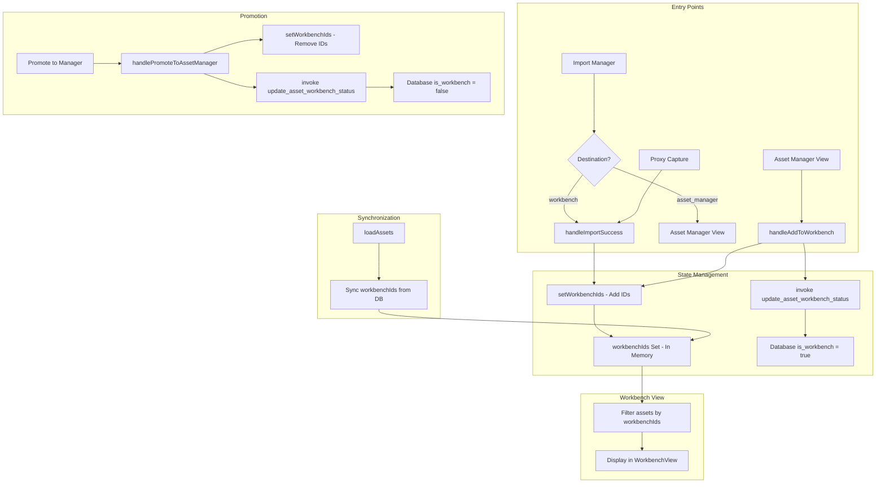

# Workbench Integration with Asset Manager - Analysis

## Executive Summary

The workbench serves as a staging area for triaging security findings before promoting assets to the asset manager. The integration relies on a dual-state system: an in-memory `workbenchIds` Set for UI performance and a persistent `is_workbench` boolean on the Asset type for database synchronization.

---

## 1. Overview of Asset-to-Workbench Workflow

### Purpose
- **Workbench**: Staging area for triaging potential endpoints and security findings
- **Asset Manager**: Long-term inventory of confirmed/promoted assets

### Key Entry Points
1. **Import Flow** - Direct import to workbench via [`ImportManager`](src/components/import/ImportManager.tsx)
2. **Asset Manager Selection** - Send selected assets from Asset Manager view
3. **Proxy Capture** - Live traffic capture routed to workbench

---

## 2. Data Flow Diagram

```
User Action                    UI State                    Database
    |                             |                           |
    v                             v                           v
[Add to Workbench] --> [setWorkbenchIds] --> [update_asset_workbench_status]
    |                        |                           |
    |                        v                           |
    |              [assets array update]  <--------------+
    |                   is_workbench: true               |
    |                        |                           |
    v                        v                           v
[Workbench View]      [Filtered by workbenchIds]   [Persisted is_workbench]
```

### Detailed Flow



---

## 3. Integration Touchpoints

### 3.1 State Management

| Location | State | Type | Purpose |
|----------|-------|------|---------|
| [`useAssetData.ts:16`](src/hooks/useAssetData.ts:16) | `workbenchIds` | `Set<number>` | In-memory tracking for UI |
| [`useAssetData.ts:28-40`](src/hooks/useAssetData.ts:28) | `loadAssets()` | Function | Syncs workbenchIds from DB `is_workbench` |
| [`types/index.ts:36`](src/types/index.ts:36) | `is_workbench` | `boolean` | Persistent DB flag on Asset |

### 3.2 Key Functions

#### Adding to Workbench
**Location**: [`AppContent.tsx:173-195`](src/components/AppContent.tsx:173)

```typescript
const handleAddToWorkbench = async (id?: number) => {
    const ids = id ? [id] : Array.from(selectedIds);
    // 1. Update database
    for (const assetId of ids) {
        await invoke('update_asset_workbench_status', { id: assetId, is_workbench: true });
    }
    // 2. Clear filters for visibility
    setSearchTerm('');
    setSmartFilter('All');
    // 3. Update local state
    setAssets(prev => prev.map(a => ids.includes(a.id) ? { ...a, is_workbench: true } : a));
    setWorkbenchIds(prev => { const next = new Set(prev); ids.forEach(i => next.add(i)); return next; });
    // 4. Full sync with DB
    await loadAssets();
};
```

#### Promoting to Asset Manager
**Location**: [`AppContent.tsx:197-211`](src/components/AppContent.tsx:197)

```typescript
const handlePromoteToAssetManager = async (id?: number) => {
    const ids = id ? [id] : Array.from(selectedIds);
    // 1. Update database
    for (const assetId of ids) {
        await invoke('update_asset_workbench_status', { id: assetId, is_workbench: false });
    }
    // 2. Update local state
    setAssets(prev => prev.map(a => ids.includes(a.id) ? { ...a, is_workbench: false } : a));
    setWorkbenchIds(prev => { const next = new Set(prev); ids.forEach(i => next.delete(i)); return next; });
};
```

#### Import Success Handler
**Location**: [`AppContent.tsx:343-363`](src/components/AppContent.tsx:343)

```typescript
const handleImportSuccess = useCallback(async (importedIds: number[], destination: ImportDestination) => {
    if (destination === 'workbench') {
        setSearchTerm('');
        setSmartFilter('All');
        setWorkbenchIds(prev => { const next = new Set(prev); importedIds.forEach(id => next.add(id)); return next; });
        setActiveView('workbench');
    } else {
        setActiveView('assets');
        setActiveFolderId(1);
    }
    await loadAssets();
}, [...]);
```

### 3.3 Context Menu Actions

**Location**: [`AppContent.tsx:282-340`](src/components/AppContent.tsx:282)

| View | Action | Handler |
|------|--------|---------|
| Workbench | Send to Asset Manager | `handlePromoteToAssetManager` |
| Workbench | Remove from Workbench | `setWorkbenchIds` (local only) |
| Assets | Add to Workbench | `handleAddToWorkbench` |
| Both | Rescan Asset | `handleRescan` |
| Both | Delete Asset | `handleDeleteAsset` |

---

## 4. Shared State Between Components

### AppContext Provider
**Location**: [`AppContext.tsx:70-104`](src/context/AppContext.tsx:70)

```typescript
// Provided to all consumers
{
    assets: Asset[],                    // Full asset list
    workbenchIds: Set<number>,          // In-memory workbench tracking
    setWorkbenchIds: Dispatch<Set<number>>,
    workbenchSort: {                    // Separate sort state for workbench
        sortConfig, handleSort, sortData
    }
}
```

### NavigationContext Provider
**Location**: [`NavigationContext.tsx:24-46`](src/context/NavigationContext.tsx:24)

```typescript
{
    activeView: ActiveView,             // Current view - 'workbench' | 'assets' | ...
    setActiveView: (view) => void,
    activeInspectorTab: InspectorTab,   // Shared inspector state
    setActiveInspectorTab: (tab) => void
}
```

---

## 5. Inspector Role in Asset-to-Workbench Workflow

### Inspector Integration
**Location**: [`Inspector.tsx:159-174`](src/components/inspector/Inspector.tsx:159)

The Inspector receives:
- `inspectorAsset`: Single selected asset (from either view)
- `workbenchSummary`: Aggregate statistics when in workbench view
- `activeView`: Current view context

### Visibility Logic
**Location**: [`AppContent.tsx:627`](src/components/AppContent.tsx:627)

```typescript
const showInspector = activeView === 'workbench' || (activeView === 'assets' && selectedIds.size === 1);
```

### Workbench Summary Calculation
**Location**: [`AppContent.tsx:89-105`](src/components/AppContent.tsx:89)

```typescript
const workbenchSummary = useMemo(() => {
    const wbAssets = assets.filter(a => workbenchIds.has(a.id));
    if (wbAssets.length === 0) return null;
    
    return {
        count: wbAssets.length,
        avgRisk: totalRisk / wbAssets.length,
        criticalCount: allFindings.filter(f => f.severity === 'Critical').length,
        findings: allFindings,
        safeCount: ...,
        warningCount: ...
    };
}, [assets, workbenchIds]);
```

### Inspector Tabs for Workbench
- **Summary Tab**: Shows aggregate workbench statistics when multiple assets selected
- **Triage Tab**: Individual asset triage status management
- **Security Tab**: Findings analysis with AI assistance
- **Exchange Tab**: Request/response inspection

---

## 6. Identified Issues and Gaps

### 6.1 Dual State Synchronization Risk
**Issue**: The system maintains both `workbenchIds` (in-memory Set) and `is_workbench` (database boolean). While `loadAssets()` syncs these, there are potential race conditions.

**Evidence**:
- [`useAssetData.ts:33-40`](src/hooks/useAssetData.ts:33) - Sync happens only on `loadAssets()`
- [`AppContent.tsx:186-194`](src/components/AppContent.tsx:186) - Local state update followed by DB update, then another `loadAssets()`

**Impact**: If operations fail between state updates, UI and DB can diverge.

### 6.2 Incomplete Remove from Workbench
**Issue**: Context menu "Remove from Workbench" only updates local state, not database.

**Location**: [`AppContent.tsx:307-313`](src/components/AppContent.tsx:307)

```typescript
label: 'Remove from Workbench',
onClick: () => {
   setWorkbenchIds(prev => {
       const next = new Set(prev);
       next.delete(id);
       return next;
   });
}
```

**Impact**: Asset remains marked as `is_workbench: true` in database. On next `loadAssets()`, it reappears in workbench.

### 6.3 No Bulk Promotion from Workbench Header
**Issue**: The "Promote to Manager" button in WorkbenchView header requires `selectedIds`, but there's no select-all mechanism visible in the header.

**Location**: [`WorkbenchView.tsx:237-247`](src/components/workbench/WorkbenchView.tsx:237)

### 6.4 Filter State Not Preserved
**Issue**: When adding to workbench, filters are cleared automatically.

**Location**: [`AppContent.tsx:182-184`](src/components/AppContent.tsx:182)

```typescript
// UX Fix: Clear filters so new assets are visible
setSearchTerm('');
setSmartFilter('All');
```

**Impact**: User loses current filter context when adding assets to workbench.

### 6.5 Workbench Clear Button Lacks DB Sync
**Issue**: The "Clear" button in WorkbenchView only clears the in-memory Set.

**Location**: [`WorkbenchView.tsx:261-266`](src/components/workbench/WorkbenchView.tsx:261)

```typescript
onClick={() => setWorkbenchIds(new Set())}
```

**Impact**: Same as 6.2 - assets remain in workbench after page reload.

### 6.6 Missing Type Safety on workbenchSort
**Issue**: `workbenchSort` prop typed as `any` in WorkbenchView.

**Location**: [`WorkbenchView.tsx:15`](src/components/workbench/WorkbenchView.tsx:15)

```typescript
workbenchSort: any;
```

### 6.7 Import Destination Handling Asymmetry
**Issue**: Import to workbench clears filters and switches view, but import to asset_manager only switches view and sets folder.

**Location**: [`AppContent.tsx:343-363`](src/components/AppContent.tsx:343)

---

## 7. Recommendations

### 7.1 Unified Workbench State Management
Create a dedicated `useWorkbench` hook that encapsulates:
- Add to workbench (with DB sync)
- Remove from workbench (with DB sync)
- Promote to asset manager (with DB sync)
- Clear workbench (with DB sync)

### 7.2 Fix Remove/Clear Operations
Update context menu "Remove from Workbench" and "Clear" button to call database update:

```typescript
// Recommended pattern
const handleRemoveFromWorkbench = async (id: number) => {
    await invoke('update_asset_workbench_status', { id, is_workbench: false });
    setWorkbenchIds(prev => { const next = new Set(prev); next.delete(id); return next; });
};
```

### 7.3 Add Optimistic UI Updates with Rollback
Wrap operations in try-catch with rollback capability:

```typescript
const handleAddToWorkbench = async (ids: number[]) => {
    // Optimistic update
    const prevIds = workbenchIds;
    setWorkbenchIds(prev => { const next = new Set(prev); ids.forEach(i => next.add(i)); return next; });
    
    try {
        for (const id of ids) {
            await invoke('update_asset_workbench_status', { id, is_workbench: true });
        }
    } catch (e) {
        // Rollback on failure
        setWorkbenchIds(prevIds);
        error('workbench', `Failed to add assets: ${e}`);
    }
};
```

### 7.4 Preserve Filter Context
Instead of clearing filters, consider:
- Adding a toast notification indicating assets were added
- Optionally navigating to workbench view
- Preserving current filter state

### 7.5 Add Select All to Workbench Header
Include a checkbox or "Select All" button in the workbench header for bulk operations.

### 7.6 Type Safety Improvements
Replace `any` types with proper interfaces:

```typescript
interface WorkbenchSort {
    sortConfig: SortConfig<Asset> | null;
    handleSort: (key: keyof Asset) => void;
    sortData: (data: Asset[]) => Asset[];
}
```

### 7.7 Event-Driven Synchronization
Consider using Tauri events for real-time sync between workbench state and database:

```typescript
// Backend emits event
emit('workbench-changed', { assetId, isWorkbench });

// Frontend listens
listen('workbench-changed', (event) => {
    // Update local state based on DB truth
});
```

---

## 8. Summary

The workbench-asset manager integration is functional but has several synchronization gaps between in-memory state and database persistence. The primary friction points are:

1. **Incomplete DB sync on remove/clear operations**
2. **Dual state management without transactional guarantees**
3. **Filter context loss during workbench operations**
4. **Type safety gaps in workbench sort handling**

Addressing these issues would improve data consistency and user experience when moving assets between the workbench and asset manager views.